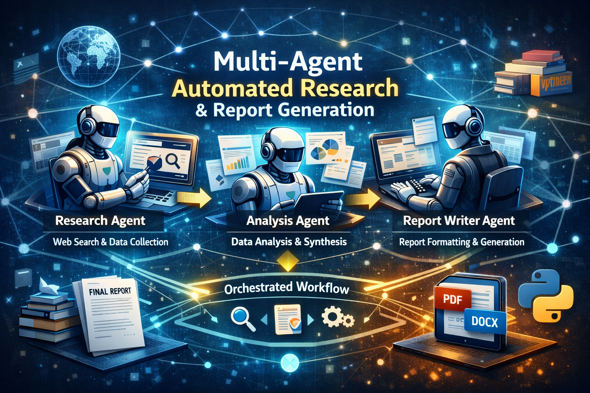

# Multi‑Agent Automated Research & Report Generation




### Overview

This repository implements a **multi‑agent system** for **automated research and report generation** using modern LLM tooling and structured orchestration. The system accepts a research topic from the user, autonomously gathers information from the web, analyzes and synthesizes findings, and produces a **fully formatted research report** (PDF or DOCX).

The architecture follows an **agent‑oriented design** and uses **LangGraph** to orchestrate execution order, state transitions, and retries.

---

### Use Case

#### Automated Research & Report Generation

**Goal**
> Produce a comprehensive, structured research report on a given topic using multiple specialized agents and integrated tools.

---

### System Architecture

#### Primary Agents

1. **Research Agent**

   * Searches the web for relevant sources
   * Collects raw content, snippets, and metadata
   * Returns structured research results

2. **Analysis Agent**

   * De‑duplicates and ranks sources by relevance
   * Extracts key insights and themes
   * Produces a structured outline / analytical brief

3. **Report Writer Agent**

   * Converts the structured brief into a complete report
   * Applies formatting and sectioning
   * Exports the final document to PDF or DOCX

---

### Tools Integrated

* **Web Search Tool**
  Wrapper around SerpAPI / Bing / Google Custom Search. If API keys are not configured, a mock search provider returns curated demo results for local development.

* **Summarization / Extraction Tool**
  Lightweight summarization utilities powered by Google GenAI, optimized for condensing long research content.

* **Document Generator Tool**
  Generates professional documents using Python libraries such as `python-docx`, `weasyprint`, or `reportlab`.

---

### Orchestration (LangGraph)

LangGraph manages the entire execution pipeline as a directed workflow graph:

   ```
   start
   ↓
   research_node
   ↓
   analyze_node
   ↓
   write_node
   ↓
   export_node
   ```

**Responsibilities of LangGraph**:

* Enforces execution order
* Manages shared state between agents
* Handles retries and failure recovery
* Enables future branching or parallelism

---

### Workflow

1. User submits a research topic via the UI.
2. Research Agent invokes the Web Search Tool to gather sources.
3. Analysis Agent synthesizes and structures the research output.
4. Report Writer Agent generates a formatted document.
5. Document Generator exports the final report (PDF / DOCX).

---

### Summary Table

| Use Case                               | Purpose                                     | Agents Involved                   | Tool Integration                              | Orchestration Role                       |
| -------------------------------------- | ------------------------------------------- | --------------------------------- | --------------------------------------------- | ---------------------------------------- |
| Automated Research & Report Generation | Produce a fully generated research document | Research, Analysis, Report Writer | Web search, summarization, document generator | Sequential pipeline managed by LangGraph |

---

### High‑Level Design

#### Agents

* **ResearchAgent**
  Gathers web content using a Web Search tool (SerpAPI optional) and stores raw snippets with metadata.

* **AnalysisAgent**
  Ingests research results, removes duplicates, ranks relevance, extracts outlines, and produces a structured analytical brief.

* **ReportWriterAgent**
  Converts the structured brief into a formatted Markdown or HTML report and exports it to PDF or DOCX.

#### Tools

* **WebSearchTool**
  Abstracts external search APIs. Falls back to a mock provider for offline development.

* **SummarizationTool**
  Uses Google GenAI to summarize and extract key points from long text segments.

* **DocumentGeneratorTool**
  Responsible for rendering and exporting documents using Python document libraries.

#### LLM

* Powered by **Google GenAI (Gemini)** via the official Python SDK.
* Includes a safe mock LLM client for local testing and CI environments.

---

### User Interface

* **Gradio Web UI**

  * Topic input field
  * Configuration options (depth, number of sources)
  * Run pipeline button
  * Download generated report

---

### Repository Structure

```
multiagent-research-report/
├─ README.md
├─ requirements.txt
├─ .env.example
├─ start.sh
├─ Dockerfile                  # optional
├─ app.py                      # Gradio UI + orchestration entry point
├─ src/
│  ├─ config.py                # central configuration loader
│  ├─ orchestrator/
│  │  └─ langgraph_workflow.py # LangGraph workflow definition
│  ├─ agents/
│  │  ├─ research_agent.py
│  │  ├─ analysis_agent.py
│  │  └─ report_writer_agent.py
│  ├─ tools/
│  │  ├─ web_search.py         # SerpAPI / mock search wrapper
│  │  ├─ summarizer.py         # summarization utilities
│  │  └─ doc_generator.py      # PDF / DOCX generator
│  └─ utils/
│     └─ llm_client.py         # Google GenAI client wrapper
└─ examples/
   └─ sample_report.pdf
```

---

### Setup & Installation

```bash
git clone https://github.com/abdi7d/multiagent-research-report.git
cd multiagent-research-report
pip install -r requirements.txt
cp .env.example .env
```

Configure API keys in `.env` if using live web search and LLMs.

---

### Running the Application

```bash
python app.py
```

The Gradio interface will launch in your browser.

---

### Future Enhancements

* Parallel research agents
* Citation tracking and reference management
* Long‑term memory with vector databases
* Multi‑language report generation
* Academic citation formats (APA, IEEE)

---

### License

[MIT License](https://github.com/abdi7d/Multi-agent-Research-Report/blob/main/LICENSE)

---

### Acknowledgements

* LangGraph
* Google GenAI (Gemini)
* Gradio
* Open‑source Python ecosystem
